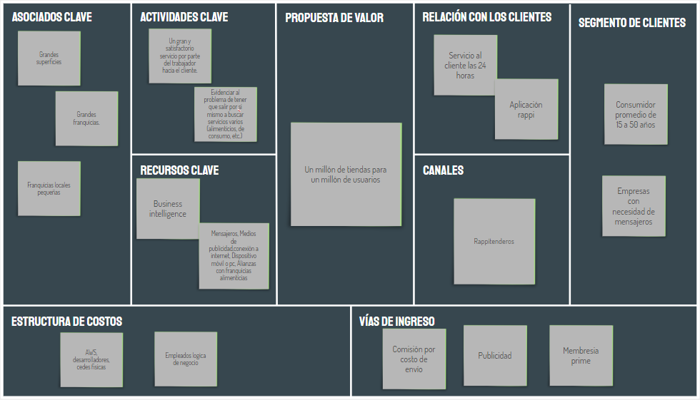
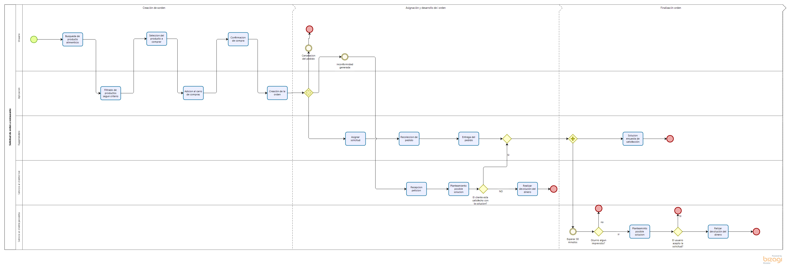

# Analisis de Rappi

Rappi es una compañía multinacional colombiana de comercio electrónico, con sede principal en Bogotá, Colombia. Activa en México, Costa Rica, Brasil, Ecuador, Uruguay, Argentina, Chile, Perú y Colombia, país donde fue fundada en 2015-1​ por Felipe Villamarin, Sebastián Mejía y Simón Borrero (CEO de la compañía).

Una de las características que define Rappi es la gama ancha de los productos y los servicios disponibles para la entrega — el co-fundador Sebastián Mejía dice " queremos ser una 'tienda de todo'". La aplicación móvil permite a los consumidores pedir el mandado del supermercado, comida, y medicamentos de farmacias, pero también permite enviar dinero en efectivo a alguien, o que un corredor retire dinero de su cuenta bancaria de un cajero automático y entregárselo. Los corredores hasta pueden pasear los perros del cliente.

# Negocio

StackEdit stores your files in your browser, which means all your files are automatically saved locally and are accessible **offline!**

 - ## Business Canvas
 
 
 - ## Diagrama de procesos
 
 - ## Organigrama

# Aplicaciones
- ## Inventario de aplicaciones
 - ## Diagrama lógico de arquitectura de aplicaciones

# Datos
- ## Diagrama de identificación de principales entidades
 - ## Diagrama lógico de arquitectura de aplicaciones

# Infraestructura de TI
- ## Diagrama de infraestructura (Red y servidores)
 - ## Inventarios de servidores y servicios

## Authors
* **[Nicolás García Rey](https://github.com/nicoga97)**

 * **[Sergio Rodríguez](https://github.com/SergioRt1)**
