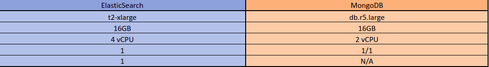

# Analisis de Rappi

Rappi es una compañía multinacional colombiana de comercio electrónico, con sede principal en Bogotá, Colombia. Activa en México, Costa Rica, Brasil, Ecuador, Uruguay, Argentina, Chile, Perú y Colombia, país donde fue fundada en 2015-1​ por Felipe Villamarin, Sebastián Mejía y Simón Borrero (CEO de la compañía).

Una de las características que define Rappi es la gama ancha de los productos y los servicios disponibles para la entrega — el co-fundador Sebastián Mejía dice " queremos ser una 'tienda de todo'". La aplicación móvil permite a los consumidores pedir el mandado del supermercado, comida, y medicamentos de farmacias, pero también permite enviar dinero en efectivo a alguien, o que un corredor retire dinero de su cuenta bancaria de un cajero automático y entregárselo. Los corredores hasta pueden pasear los perros del cliente.

# Negocio

 - ## Business Canvas
 
 Podemos representar el modelo de negocio de Rappi a través del siguiente modelo canvas 
 
 
 
 - ## El negocio de Rappi
 
 Rappi es una compañía multinacional que opera en 9 países, cuenta con cerca de 1500 empleados y 100,000 Rappitenderos, la empresa persigue la idea de 
 suplir todos los servicios a través de una aplicación al alcance de todos, con el lema un millón de tiendas para un millón de usuarios.
 
   
 
 - ## Diagrama de procesos
  Vamos a revisar un proceso en concreto de la compañía, que se centra en la solicitud de un pedido a través de la aplicación y en concreto a través del área de restaurantes. 
  
 
 
 - ## Organigrama
 - ### Organigrama general
   La compañía cuenta con una estructura tradicional, liderada por un CEO y dividida en 11 ramas que se encargan de tareas especificas para el funcionamiento de la compañía, algunas relacionadas con el 
   crecimiento, mantenimiento, proyección y desarrollo tecnológico de la compañía, nos vamos a centrar en el área tecnológica de la compañía. 
  
  
  
  - ### Organigrama TI
   Esta se divide por verticales que se encargan de diferentes servicios dentro de lla aplicación, cada vertical está dirigida por su vicepresidente de tecnología, luego está el product manager que es el encargado de priorizar y 
   decir que van a hacer los desarrolladores, ya sean peticiones del área de negocio o de mantenimiento y escalabilidad. El grupo de desarrolladores está liderado por lideres tecnicos los cuales cada uno se encarga de liderar celdas de desarrollo de 
   su especialidad ya sea desarrollo Backend, Frontend Android o IOS.
   
   
   

# Aplicaciones
- ## Inventario de aplicaciones
  La compañía usa varias aplicaciones y herramientas, las de desarrollo ágill son aplicaciones que permiten el desarrollo rápido de aplicaciones web, por lo general de uso interno.
  Las aplicaciones que soportan el flujo de desarrollo ayudan a aplicar DevOps, hacer versionamiento del codigo y aplicar metodologías ágiles como scrum.
  Las aplicaciónes de monitoreo permiten visualizar logs, o información de los microservicios como el uso de recursos y detectar anomalías y corregirlas de forma rapida.
  Las aplicaciones desarrolladas in house son un grupo de aplicaciones que se usan generalmente para uso interno, como herramientas de automatización de ciertos procesos o herramientas para el equipo de negocio.
   
  
  
 - ## Diagrama lógico de arquitectura de aplicaciones
  Diagrama general de alto nivel de la arquitectura que se estudia:
  
  

# Datos
- ## Diagrama de identificación de principales entidades
Presentamos las principales entidades de información para la compañía

 - ## Diagrama lógico de arquitectura de aplicaciones
 Este diagrama se enfoca en el área de la arquitectura en la que se identificó el problema, la parte superior del diagrama es la que 
 se encuentran los servicios que proveen información a los usuarios y abajo los que proveen la sincronización y actualización de la información de las tiendas y productos. 
 
 

# Infraestructura de TI
- ## Diagrama de infraestructura (Red y servidores)
 Se presenta el diagrama general de infraestructura el Rappi:
 
 
 
 - ## Inventarios de servidores y servicios
 Estos son los servidores que se ven principalmente involucrados en el area de estudio:
 
 
 
# Problematica TI

 Rappi está teniendo unos altos costos en infraestructura  debido a que su microservicio 
 de búsqueda de productos y de actualización del estado de estos se encuentran en una misma 
 base de datos montada en elasticsearch, actualmente se tienen el plan más completo y con mayor
 capacidad de cómputo que ofrece elastic y aun así  cuando se presentan picos de tráfico la actualización
 de disponibilidad de productos llega a tener un delay de 15 minutos desde que la tienda cambia un producto y este se ve
 reflejado en la aplicación del usuario final
 
 - ## Impacto
    - inconformidad de los usuarios: En hora pico el tráfico de los microservicios en general es considerablemente más alto, en estos picos de tráfico habia ocaciones en las que se generaba indisponibilidad
    lo que afectaba a los usuarios y la imagen de la compañía.
    
    - Costos elevados en infraestructura: El límite del crecimiento vertical de los servidores había sido alcanzado y con él el costo de los servidores
    alcanzando la cifra de los 1,200 USD/Día o 36,000 USD/Mes
    
 - ## Cambios e impacto en negocio
    - Nuevo plan de ElasticSearch: Se va a adquirir un nuevo plan de ElasticSearch con ElaticCloud que se ajuste a las nuevas necesidades gracias a la poca actualización de los datos en la base de datos en elastic es posible bajar a un plan con un costo de 4 500 usd/mes 
    - AWS: Es requerida una máquina en aws con DocumentDB para manejar la actualización de productos que tiene un costo aproximado de 700 USD MES
 
  
  
 - ## Arquitectura técnica de la solución
 Se presenta una solución al problema que consiste en aligerar la carga de la base de datos agregando otra que se use para resolver el catálogo de tiendas, 
 dejando la base de datos de ElastiSearch exclusivamente para las consultas que se realicen a través del buscador, esto representa el reto de replicar la información y evitar inconsistencias entre las dos fuentes de información
 
  
  
 - ## Costo de la implementación y operación
   - Desarrolladores (2400 USD): Se necesitan 4 desarrolladores y 48 horas de trabajo para desarrollar la solución. (Hora de desarrollo 12,5 USD)
   - ElasticSerach (4500 USD/Mes): Con el desarrollo de la solución se necesitaría un nuevo plan de Elasticsearch con un costo de  4,500 USD/mes
   - AWS (700 USD/Mes): Con el desarrollo de la solución es necesario utilizar AWS con el fin de albergar el desarrollo hecho con un costo aproximado de 700 USD/MES según tráfico actual
   - Personal extra (2000 USD/Mes): Se necesita un desarrollador adicional fijo cuyas funciones entre otras serán mantenimiento y operación de  esta nueva solución
  
    #### análisis beneficio costo
    - Costo anual antes de implementación: 432,000 USD
    - Costo anual después de implementación y operación: 64,800 USD 
    
    
    Total ahorro: $343.200,00 USD/AÑO
    Relación b/c =  3,9
 
   

 - ## Prototipo
  Con el fin de realizar pruebas de carga en el prototipo se usó Loctus en Python sobre una instancia de Amazon EC2, se creó un [cliente en GO](code) que simula el comportamiento de la arquitectura de las dos arquitectura para poder comparar las.
  Se montó una base de datos de ElasticSearch sobre un contenedor Docker en una instancia de Amazon EC2 y se creó un cluster de Amazon DocumentDB. 
  
  
  
  La prueba se realizó con la siguiente estructura:
  
  
  
  Cada base de datos estaba poblada con 40000 documentos con datos aleatorios, a continuacion se presentan las especificaciones de las máquinas usadas en la prueba.
  
  
  
   ### Resultados de la prueba
   La primera prueba consiste en hacer un MultiGetById sobre las dos alternativas, cada request era un mget de 1500 documentos.
   
   
   (En azul ElasticSearch y en naranja DocumentDB)
   
   
   
   La segunda prueba es hacer un update masivo (bulkUpdate) sobre las dos alternativas, cada request lleva 1500 documentos para actualizarse.
   
   
   (En azul ElasticSearch y en naranja DocumentDB)
   
   
   
   La tercera prueba consiste en simular un ambiente similar al que tendría cada arquitectura en producción, la mitad de los request son MultiGetById de a 1500 documentos y la otra mitad son bulkUpdate de a 600.
   
   
   (En azul ElasticSearch y en naranja DocumentDB)
   
   
    
   Podemos observar como documentDB es considerablemente más consistente con los tiempos de respuesta y es capaz de soportar una mayor carga.
  
 - ## Conclusiones y trabajo futuro
   - Herramientas: Se debe hacer uso óptimo de las herramientas proporcionadas en una organización y usar las herramientas adecuadas para el fin adecuado.
   - Escalabilidad: Esta solución brinda más escalabilidad a través del tiempo, lo cual es vital para la compañía al largo plazo.
   - Costo: La implementación de esta solución reduciría considerablemente los costos de este servicio y en infraestructura.

## Authors
 * **[Nicolás García Rey](https://github.com/nicoga97)**

 * **[Sergio Rodríguez](https://github.com/SergioRt1)**
